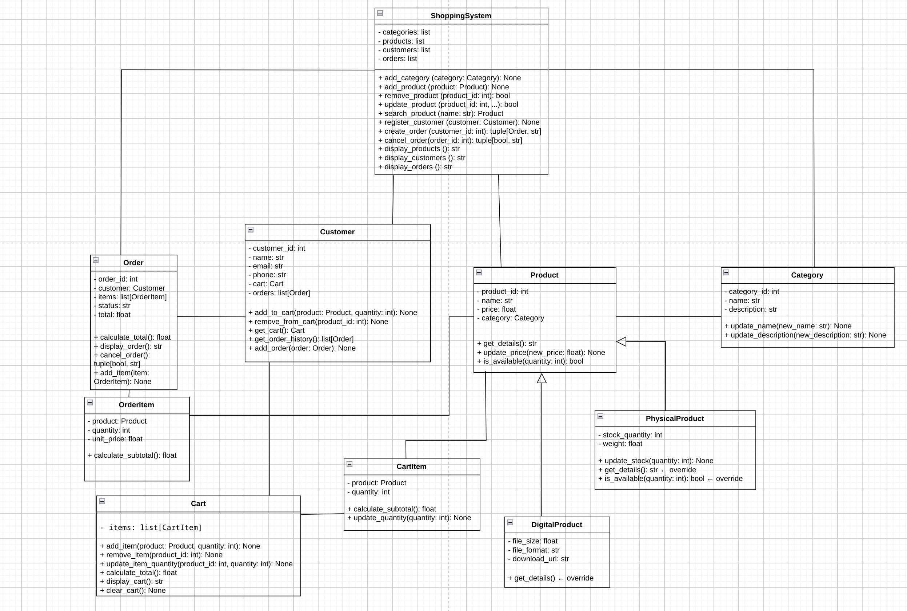

<div align="center">
    <h1>🛒 Online Shopping Management System 🛒</h1>
</div>

---

## Developed by

| Names |
| ------- |
| Ahmed Hossam |
| Kareem Hesham |
| Rofaida Samy |
| Sara Elsayed |
| Sara Fouda |
| Ahmed Mohamed |

---

## 1. Problem Description


This project simulates a simple **online store backend** using pure Python and Object-Oriented Programming.
It allows the shop to manage its **products** (physical and digital), organize them into **categories**,
register **customers**, let each customer build a **shopping cart**, and turn that cart into a confirmed
**order** with a calculated total. The system also validates simple business rules, such as preventing an
order when a physical product is out of stock.

---

## 2. Classes

| Class | Responsibility |
| ------- | ------- |
| `Category` | Represents a group of products (e.g. Electronics, Books). |
| `Product` | Base class for any item sold in the store (id, name, price, category). |
| `PhysicalProduct` | A product with real stock and shipping cost (inherits `Product`). |
| `DigitalProduct` | A product with no stock limit and a download link (inherits `Product`). |
| `Customer` | Represents a shopper: personal info, their cart, and their order history. |
| `Cart` | Holds a list of `CartItem`, calculates the running total before checkout. |
| `CartItem` | A single product + quantity inside a cart. |
| `Order` | A confirmed purchase created from a cart, holding a list of `OrderItem`. |
| `OrderItem` | A single product + quantity + price at the time of the order. |
| `ShoppingSystem` | The central manager: owns all customers, products, categories and orders, and coordinates every operation between them. |

---

## 3. Modules

| Module | Contains |
| ------- | ------- |
| `models.py` | `Category`, `Product`, `PhysicalProduct`, `DigitalProduct` |
| `customers.py` | `Customer` |
| `cart.py` | `Cart`, `CartItem` |
| `orders.py` | `Order`, `OrderItem` |
| `system.py` | `ShoppingSystem` |
| `main.py` | Demonstration script (no class definitions) |

---

## 4. Relationships

- **`Product` → `Category`**: every product belongs to exactly one category.
- **`PhysicalProduct` / `DigitalProduct` → `Product`**: both inherit from `Product` and override `get_details()`; `PhysicalProduct` also overrides `is_available()` to check real stock.
- **`Customer` → `Cart`**: each customer owns exactly one cart (composition — the cart doesn't exist without the customer).
- **`Cart` → `CartItem`**: a cart holds many cart items; each item points to one product.
- **`Customer` → `Order`**: a customer can have many past orders (order history).
- **`Order` → `OrderItem`**: an order holds many order items, copied from the cart at checkout time.
- **`ShoppingSystem`**: holds and coordinates all customers, products, categories, and orders — it's the only class that creates or cancels an order.

---

## 5. How to Run the Project

```bash
python main.py
```

---

## 6. Diagram



## 7. Restrictions Followed

```py
Database / SQL   ❌ not used
Flask / Django   ❌ not used
GUI              ❌ not used
Authentication   ❌ not used
```

## 8. Output Example

see: [output.txt](./output.txt)

## 9. OOP concepts used
- Classes and Objects
- Constructors and Attributes
- Methods
- Inheritance
- Relationships between objects
- Interaction between classes
- ovverriding methods
- Encapsulation
- Polymorphism

